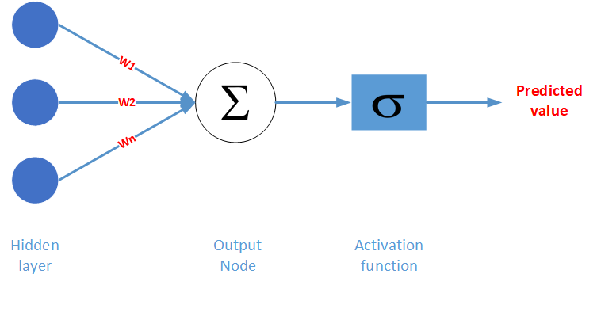
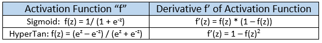
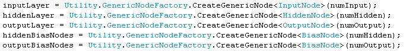
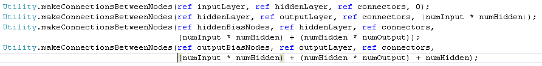
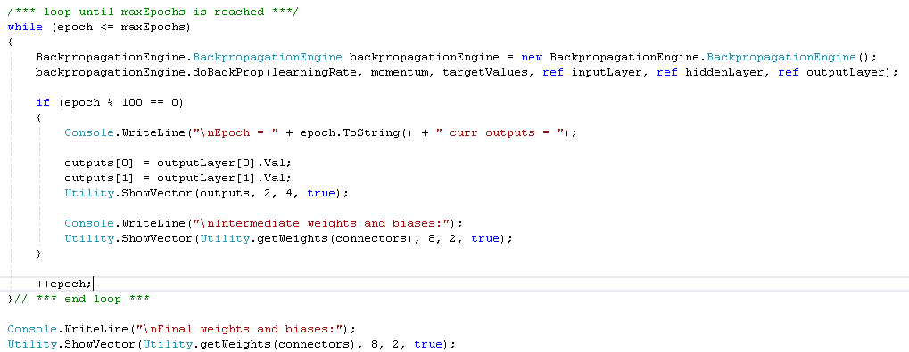

# The Backpropagation Engine
> A stand alone class library for performing backpropagation on a neural network

## Introduction

In an artificial neural network (ANN) back-propagation is a method for training the network model. It is the process of adjusting the weights of the connectors that join the nodes based on the gradient of an error value at the output layer. The goal of this project is to write a single API to call when the back-propagation step is to be performed. The user simply has to provide a handful of parameters that include the neural network's layers as well as the model's learning rate and momentum. My overarching goal here is not to create something that scales or is highly performant. It is to develop a better understanding of the back-propagation process by more closely examining its discrete steps.

For the purposes of this article I'll assume that you are familiar with stochastic gradient descent as it is applied to training an ANN. I will make use of the UML-based approach to ANNs that I described in my prior posts. There I treat the layers of an ANN as lists of node objects. The nodes are joined by connector objects each having a weight parameter. A node object has a collection of inbound connectors and another collection for outbound connectors. A connector is associated with a "from node" and a "to node". This fully connected approach allows access to the components (nodes and weights) of the ANN from any point in the model.

## Basic Steps
Back-propagation begins with the calculation of the activation values for every node in each of the hidden layers working towards the output layer in the ANN. Upon arrival at the output layer the following steps are performed culminating in the adjustment of the weights between the layers.

1. Calculate the activation sum at a output layer node

2. Calculate the output node's gradient by multiplying the derivative of the output node's activation by the output error (defined as target - predicted). The activation function applied will determine the form of the derivative. Here are some examples of activation function derivatives. Assume that the error "z" = target - predicted.

3. Calculate a hidden layer node gradient by multiplying the derivative of the hidden node's activation by the sum of the products of the output node gradients and the associated connector weight

4. A weight is adjusted using the input value from the connector's "from node" and the gradient associated with its "to node". For example, the weight delta between a hidden node and an output node would be: weight delta = learning rate * output node gradient * hidden node activation value. The model's momentum parameter is added to the delta value and the delta value is added to the current weight value.

## Implementation
To apply the back-prop API we first have to construct an ANN model. The basic form of the model is a 3-4-2. I will apply my previous post - "A UML-based Approach to Machine Learning – Part 1" to accomplish the following:

* Use the GenericNodeFactory to create the collection of nodes for each layer including the bias nodes for the hidden and output layer

* After instantiating the Inbound and Outbound connector lists for each node join the input and hidden layers, the hidden and output layers and the bias nodes

* Now that the model's nodes and connectors are hooked-up back-propagation may begin. The following code segment shows the instantiation of the Backpropagation object and its use in a loop that executes until a stop condition is reached. 

Notice that the entire ANN model is passed into the "doBackProp" method in the form of the   InputLayer, HiddenLayer and OutputLayer collections. The target values vector is passed in to allow calculation of the error values at the output layer.
